# DLMapboxUtil

Mapbox for jetpack compose 地图封装（含离线地图）

# 当前版本

`1.5.0`

# 特性

- 使用jetpack compose框架
- 支持地图类型切换
- 支持离线地图下载
- 支持天地图
- 支持POI搜索
- 支持直线导航（简单导航用于飞行航空）

# 效果预览

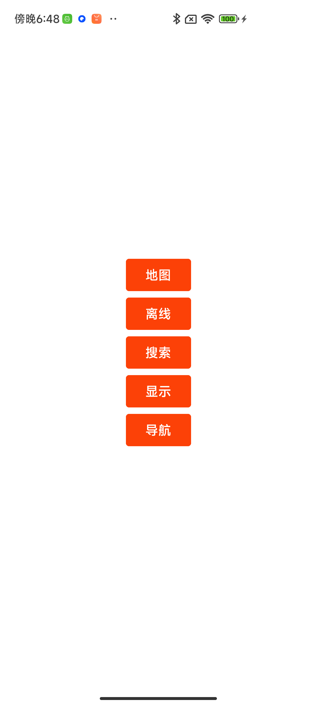 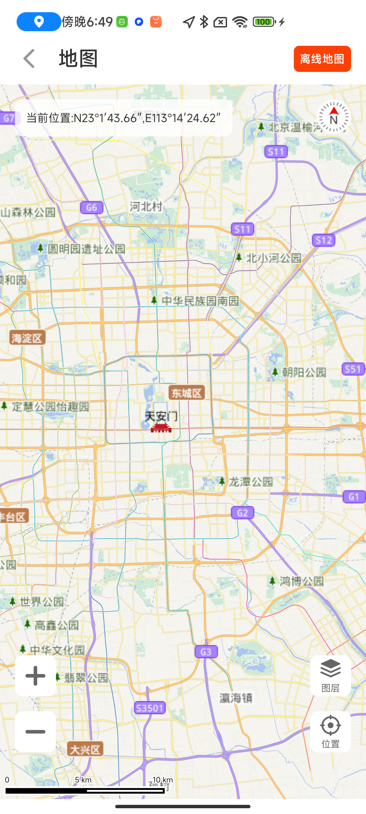 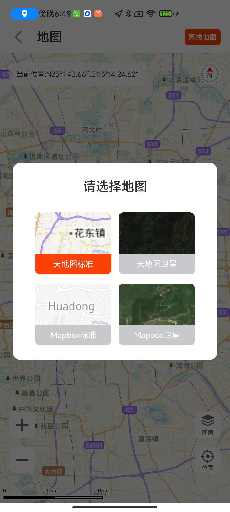 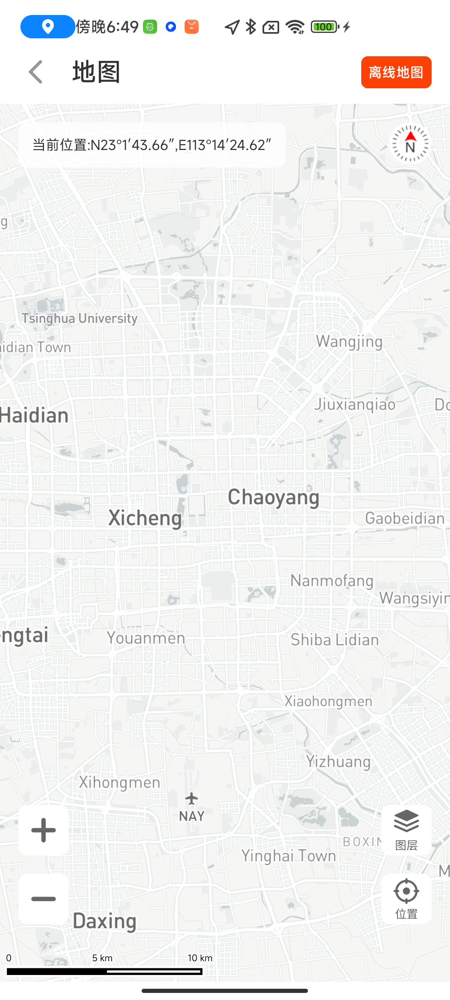 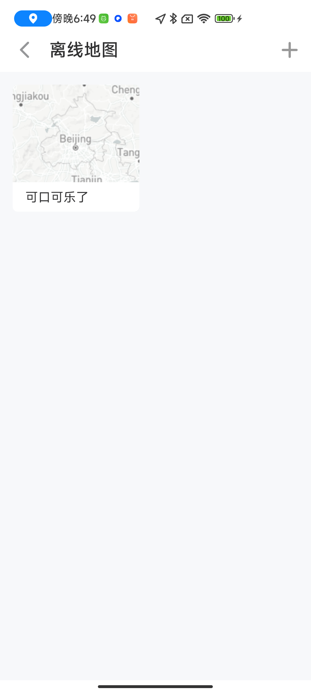 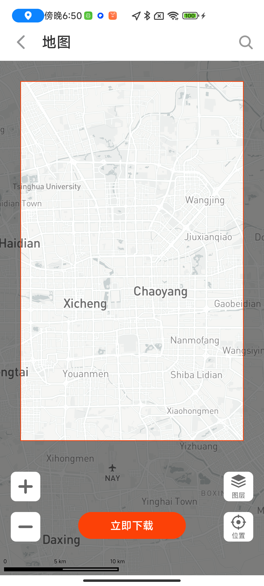 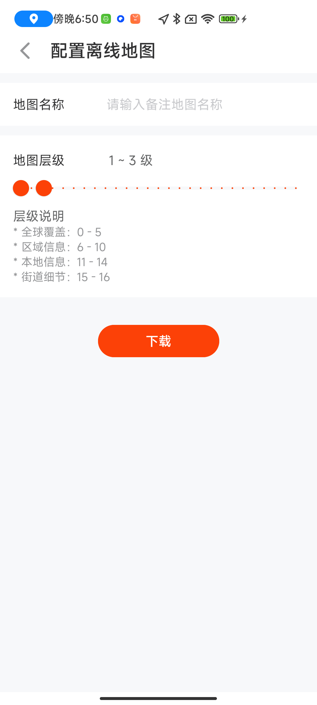 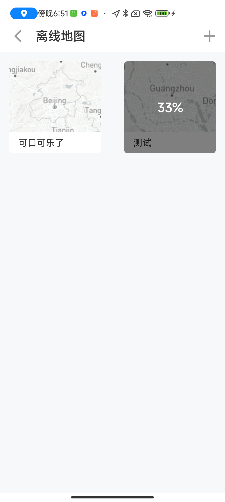 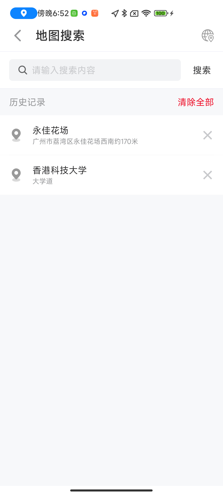 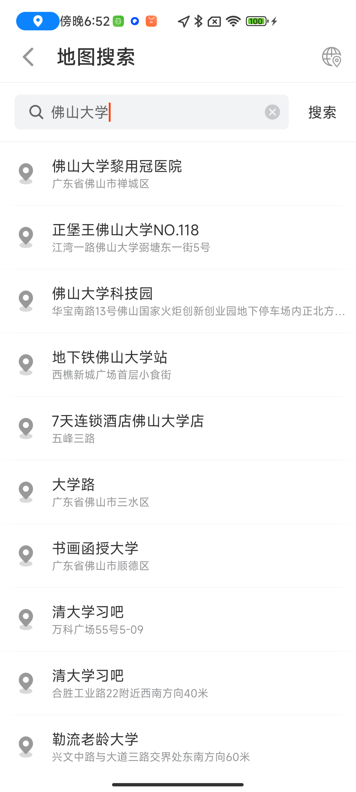 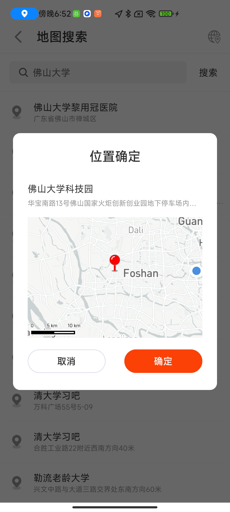 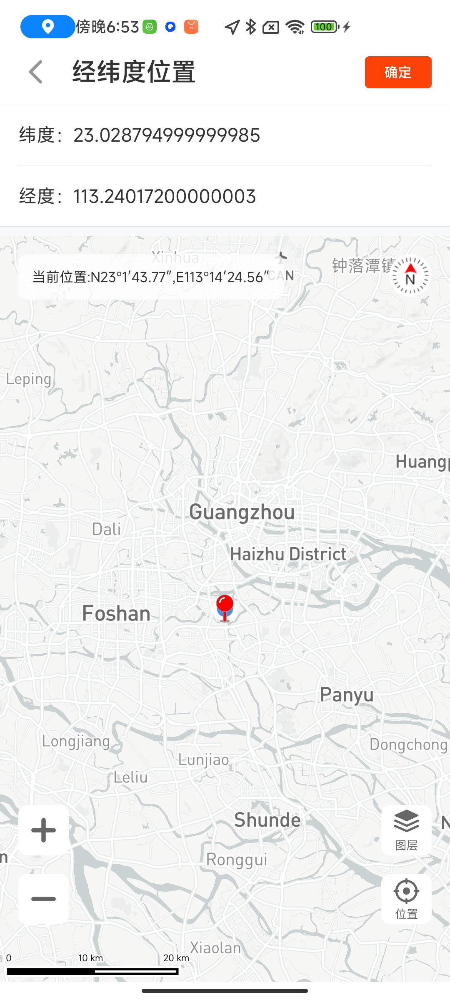 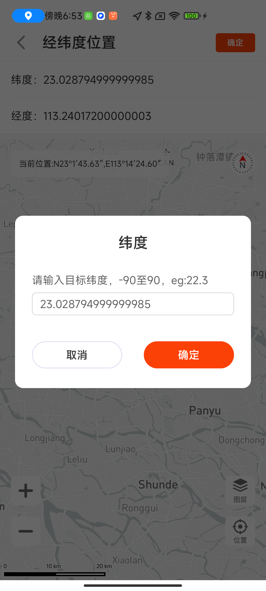 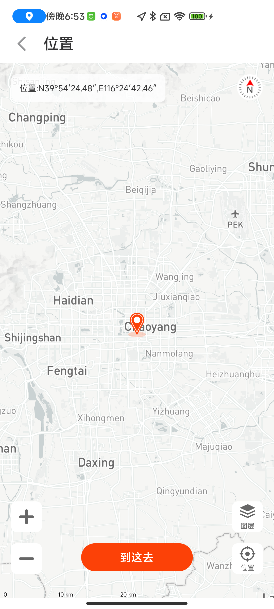 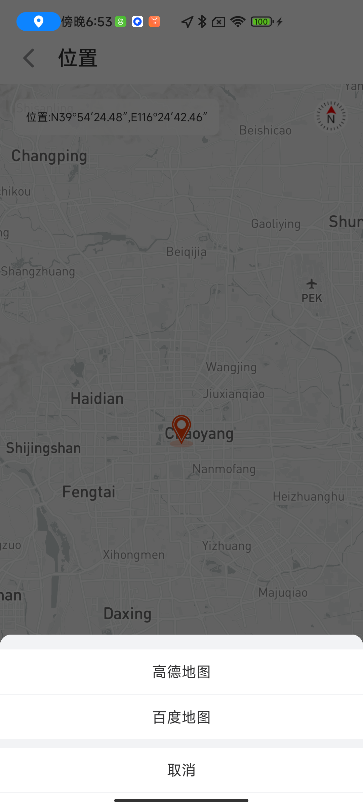 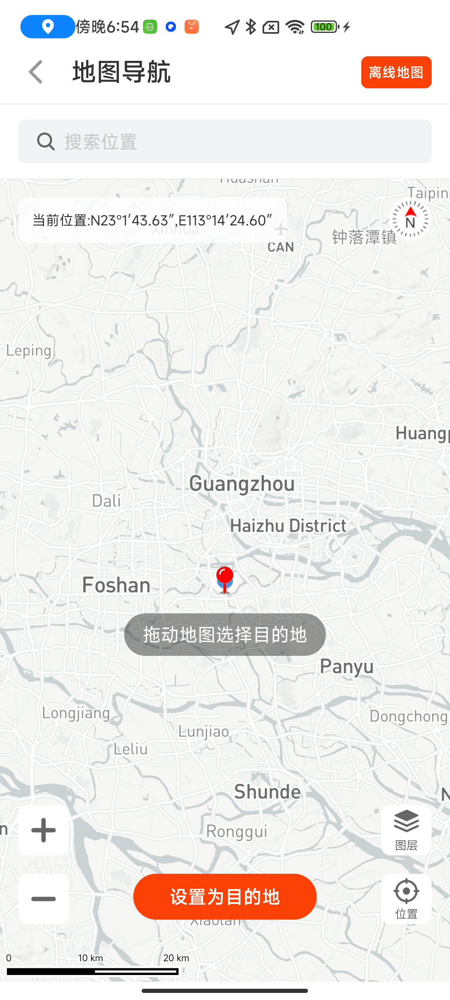 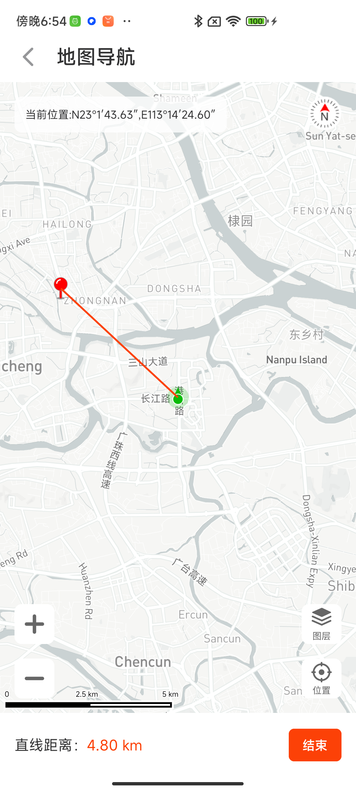 

# 使用说明

1 添加仓库

```build.gradle
allprojects {
  repositories {
    ...
    // 0.8版本(含)之前使用jitpack
    maven { url 'https://jitpack.io' }
    // 0.9.2版本以后不再使用jitpack
    maven { url "https://raw.githubusercontent.com/D10NGYANG/maven-repo/main/repository" }
  }
}
```

2 添加依赖

```build.gradle
dependencies {
    // 地图封装
    implementation("com.github.D10NGYANG:DLMapboxUtil:1.5.0")
}
```

# 1.5.0 更新说明

- 导航实现迁移到 Jetpack Navigation 3，移除 `raamcosta-compose-destinations` 相关代码。
- 地图页面支持沉浸式边到边布局，地图内容可以延伸到状态栏和导航栏区域；系统栏不作为地图操作区域。
- 比例尺与地图底部安全区同步，避免被导航栏遮挡。
- 首次进入地图时自动等待首个有效定位并居中到用户位置。
- 缩放和回到当前位置使用平滑相机动画，并避免动画中间帧反复触发状态更新。
- 位置确认标记使用底部锚点，确保标记尖端与目标坐标重合。
- 移除不必要的 `constraintlayout-compose` 依赖，改用 Compose 基础布局实现页面排布。
- 使用 Mapbox NDK 27 产物，支持 Android 15 的 16 KB 原生库对齐要求。

# 从 1.4.x 迁移

1. 将依赖版本改为 `1.5.0`，并删除项目中对 `raamcosta-compose-destinations` 的直接依赖和生成导航图代码。
2. 按 Navigation 3 方式维护 `NavKey` 路由、`rememberNavBackStack` 和 `NavDisplay`；示例路由见 `mapbox/src/main/java/com/d10ng/mapbox/activity/navigation/NavigationRoutes.kt`、`OfflineRoutes.kt` 和 `LocationSearchRoutes.kt`。
3. 如果宿主页面自行使用 `MapboxView`，保留 `cameraTarget`、`cameraZoom` 和 `cameraPadding` 的状态来源；相机状态变化通过 `onCameraCenterChange`、`onCameraZoomChange` 回写。
4. 地图页面建议使用 `enableEdgeToEdge()`，并确保宿主 APK 的原生库采用 `useLegacyPackaging = false`。
5. `constraintlayout-compose` 不再是 `DLMapboxUtil` 的必需依赖；只有宿主项目仍直接使用 `ConstraintLayout` 时才需要自行保留。

完整公开 API 请参阅 [docs/API.md](docs/API.md)。

3 Android 16 KB 页面支持

`1.5.0` 起使用 Mapbox NDK 27 产物并支持 Android 15 的 16 KB 原生库对齐。当前版本以 compileSdk 36、Gradle 8.13、AGP 8.13.2、Kotlin 2.2.20 构建。最终 APK/AAB 仍由宿主应用打包，因此宿主项目需要使用兼容的构建链，并保持原生库为非 legacy 打包：

```kotlin
android {
    packaging {
        jniLibs {
            useLegacyPackaging = false
        }
    }
}
```

发布前可使用 Android SDK Build Tools 35.0.0 或更高版本检查 APK：

```bash
zipalign -c -P 16 -v 4 app-release.apk
```

如果检查仍失败，需要继续升级 APK 中报告的其他第三方原生库。

# 代码

```kotlin
class MainActivity : ComponentActivity() {
    override fun onCreate(savedInstanceState: Bundle?) {
        enableEdgeToEdge()
        super.onCreate(savedInstanceState)

        // 锁定屏幕方向
        lockScreenOrientation()

        // 自定义颜色
        initColor()

        // 初始化TOKEN
        MapboxUtil.init(BuildConfig.myMapboxToken, BuildConfig.myTiandituToken, true)

        setContent {
            var selectPoint by remember {
                mutableStateOf(Point.fromLngLat(116.411794, 39.9068))
            }
            Column(
                modifier = Modifier
                    .fillMaxSize()
                    .background(Color.White)
                    .systemBarsPadding(),
                verticalArrangement = Arrangement.Center,
                horizontalAlignment = Alignment.CenterHorizontally
            ) {
                Button(text = "地图", type = ButtonType.PRIMARY, onClick = {
                    goTo(MapActivity::class.java)
                })
                Button(text = "离线", type = ButtonType.PRIMARY, onClick = {
                    goTo(MapOfflineActivity::class.java)
                })
                Button(text = "搜索", type = ButtonType.PRIMARY, onClick = {
                    LocationSearchManager.startActivity(this@MainActivity) {
                        if (it != null) {
                            selectPoint = it
                        }
                    }
                })
                Button(text = "显示", type = ButtonType.PRIMARY, onClick = {
                    goToLocationShowActivity(selectPoint.latitude(), selectPoint.longitude())
                })
                Button(text = "导航", type = ButtonType.PRIMARY, onClick = {
                    goTo(MapNavigationActivity::class.java)
                })
            }
        }
    }
}

fun initColor() {
    AppColor.Main.primary = Color(0xFFFC4107)
}
```
