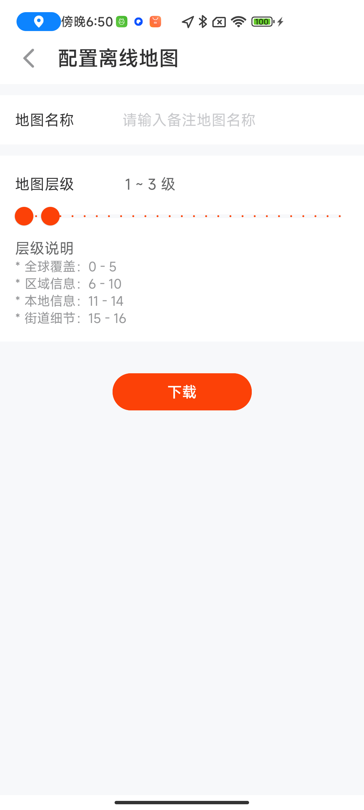

# DLMapboxUtil

Mapbox for jetpack compose 地图封装（含离线地图）

# 特性

- 使用jetpack compose框架
- 支持地图类型切换
- 支持离线地图下载
- 支持天地图
- 支持POI搜索
- 支持直线导航（简单导航用于飞行航空）

# 效果预览

                 

# 使用说明

1 添加仓库

```build.gradle
allprojects {
  repositories {
    ...
    // 0.8版本(含)之前使用jitpack
    maven { url 'https://jitpack.io' }
    // 0.9.2版本以后不再使用jitpack
    maven { url "https://raw.githubusercontent.com/D10NGYANG/maven-repo/main/repository" }
  }
}
```

2 添加依赖

```build.gradle
dependencies {
    // 地图封装
    implementation("com.github.D10NGYANG:DLMapboxUtil:1.1.0")
    // jetpack compose 框架
    implementation("com.github.D10NGYANG:DLJetpackComposeUtil:2.0.1")
    // APP通用工具
    implementation("com.github.D10NGYANG:DLAppUtil:2.4.6")
    // 通用处理工具
    implementation("com.github.D10NGYANG:DLCommonUtil:0.0.2")
    // 经纬度工具
    implementation("com.github.D10NGYANG:DLLatLngUtil:1.7.5")
    // 天地图API
    implementation("com.github.D10NGYANG:DLTianDiTuApi:0.5.4")
    // 网络请求框架
    implementation("com.github.D10NGYANG:DLHttpUtil:0.8.5")
    // jetpack datastore 封装工具
    implementation("com.github.D10NGYANG:DLDatastoreUtil:0.0.1")
}
```

# 代码

```kotlin
class MainActivity : ComponentActivity() {
    override fun onCreate(savedInstanceState: Bundle?) {
        super.onCreate(savedInstanceState)

        // 锁定屏幕方向
        lockScreenOrientation()
        // 设置透明状态栏
        setStatusBar()

        // 自定义颜色
        initColor()

        // 初始化TOKEN
        MapboxUtil.init(BuildConfig.myMapboxToken, BuildConfig.myTiandituToken, true)

        setContent {
            var selectPoint by remember {
                mutableStateOf(Point.fromLngLat(116.411794, 39.9068))
            }
            Column(
                modifier = Modifier
                    .fillMaxSize()
                    .background(Color.White),
                verticalArrangement = Arrangement.Center,
                horizontalAlignment = Alignment.CenterHorizontally
            ) {
                Button(text = "地图", type = ButtonType.PRIMARY, onClick = {
                    goTo(MapActivity::class.java)
                })
                Button(text = "离线", type = ButtonType.PRIMARY, onClick = {
                    goTo(MapOfflineActivity::class.java)
                })
                Button(text = "搜索", type = ButtonType.PRIMARY, onClick = {
                    LocationSearchManager.startActivity(this@MainActivity) {
                        if (it != null) {
                            selectPoint = it
                        }
                    }
                })
                Button(text = "显示", type = ButtonType.PRIMARY, onClick = {
                    goToLocationShowActivity(selectPoint.latitude(), selectPoint.longitude())
                })
                Button(text = "导航", type = ButtonType.PRIMARY, onClick = {
                    goTo(MapNavigationActivity::class.java)
                })
            }
        }
    }
}

fun initColor() {
    AppColor.Main.primary = Color(0xFFFC4107)
}
```
